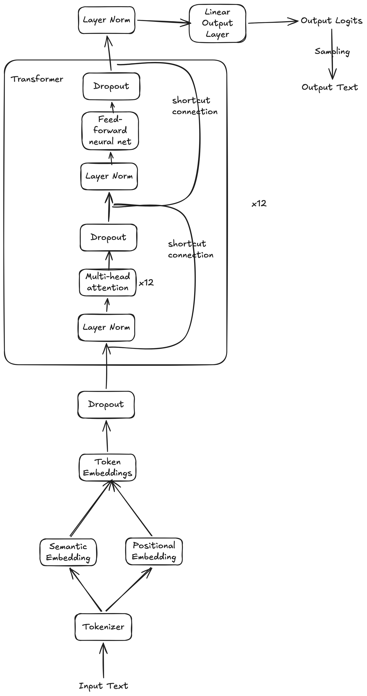
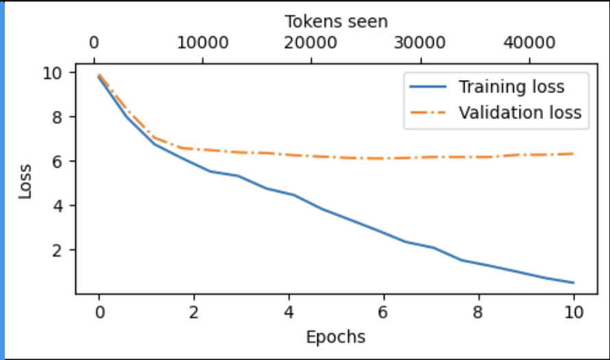
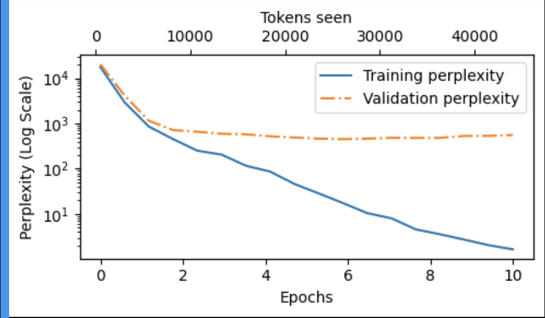
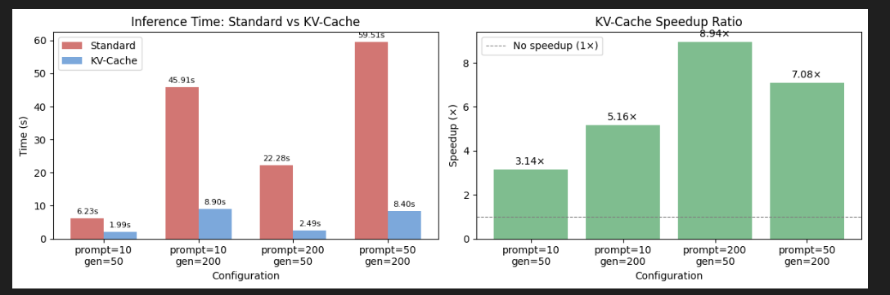

# GPT 2.0 from Scratch

I trained a 124M parameter GPT-2 model from scratch on my 2019, 1.4 GHz Quad-Core Intel Core i5 Macbook Pro. 

Further, I:
* Implemented KV-caching and ran experiments to unpack its compute gains and memory costs
* Implemented speculative decoding to understand its inference boost
* Created a visualizer to showcase what the model was "thinking" at each step as it processed an input

## Model Architecture



https://excalidraw.com/#json=kEtqwgDj8AgcazuEOskfg,y6R5g3fUyITXRsBLGTsqIQ

## Key Params

* 124M parameters
* 12 transformer layers
* 12 multi head attention modules within each transformer
* GeLU activation for the Feed Forward Network
* Context window: 256 tokens
* Optimization: AdamW with a learning rate of 0.0004 and 0.1 weight decay.
* Embedding dimension: 768
* Stride: 256 (Zero-overlap for maximum data efficiency).
* Tokenizer: Tiktoken (`tiktoken.get_encoding("gpt2")`)
* Input Data: To make it possible to train the model on my personal Macbook Pro, I used a toy dataset - 'The Verdict' by Edith Wharton containing 5120 tokens. However, the same code should work for larger models as well (only that it'll take more time!)
* Train-validation split: 90-10.

## Training Performance
The model was trained for 10 epochs using the AdamW optimizer.

It took 13 minutes on my 2019, 1.4 GHz Quad-Core Intel Core i5 Macbook Pro






## Sample Output
* **Prompt:** "Every effort moves you"
* **Generated:** "Every effort moves you?" "Yes--quite insensible to the irony. She wanted him vindicated--and by me!"

Yes, the generated output doesn't quite match up to a modern LLM, but:
* the architecure follows the real GPT-2.0 closely
* was trained on a much smaller dataset to make it possible on my personal macbook pro
* is not instruction tuned

## Experiments

### 1. KV Caching

#### KV Caching makes inference faster

Compared the inference time, with and without KV-caching, for the small 124M parameter GPT-2 model.



**How it works:**
* **Standard inference:** At every decode step $i$, the model re-processes the entire sequence of length $P + i$ through attention ($P$ = prompt length). Total cost across all $G$ steps: $\sum_{i=0}^{G-1}(P+i)^2$, i.e. $O(n^2)$.
* **KV-Cache inference:** The prompt is processed once (prefill) and its $K$/$V$ tensors are stored. Each decode step processes only the 1 new token, attending over the growing cache. Total cost: $P^2 + \sum_{i=0}^{G-1}(P+i)$, i.e. $O(n)$.

**What actually drives speedup?**

The theoretical speedup is the ratio of total FLOPs (attention cost $\propto$ sequence\_length² per step):

$$\text{Speedup} = \frac{\overbrace{\displaystyle\sum_{i=0}^{G-1}(P+i)^2}^{\text{standard inference}}}{\underbrace{\displaystyle P^2 + \sum_{i=0}^{G-1}(P+i)}_{\text{KV-cache inference}}}$$

Expanding in closed form makes the dependence on $P$ and $G$ explicit:

$$\text{Standard} = \underbrace{G P^2}_{\text{prompt, paid }G\times} +\ \underbrace{P G(G-1)}_{\text{cross}} +\ \underbrace{\tfrac{G(G-1)(2G-1)}{6}}_{\sim\,G^3/3}$$

$$\text{KV-cache} = \underbrace{P^2}_{\text{prefill (once)}} +\ \underbrace{G P}_{\text{cross}} +\ \underbrace{\tfrac{G(G-1)}{2}}_{\sim\,G^2/2}$$

Key implications:
* **Increasing $G$**: numerator grows $\sim G^3$; denominator only $\sim G^2$ → speedup scales roughly $\propto G$.
* **Increasing $P$**: adds $GP^2$ to the numerator (amplified $G\times$!) vs just $P^2$ to the denominator → larger prompts also widen the gap, but less dramatically than longer generation.
* **`total_tokens` is misleading**: two configs with the same $P+G$ can yield very different speedups depending on the $P$/$G$ split.

Applying the formula to representative configs:

| Config (P, G) | Total tokens | Theoretical speedup |
|---|---|---|
| prompt=10, gen=50 | 60 | ~38x |
| prompt=10, gen=200 | 210 | ~173x |
| prompt=200, gen=50 | 250 | ~50x |
| prompt=50, gen=200 | 250 | ~159x |

Two configs with the same total tokens (250) differ by **3x** in speedup, purely because gen_len differs.

**Theory vs. practice anomaly:**

Empirically, `prompt=200, gen=50` showed *higher* speedup than `prompt=50, gen=200`, contradicting the theoretical prediction. Each KV-cache decode step carries a fixed per-step overhead (Python loop, PyTorch dispatch, memory allocation) independent of sequence length. With $G=200$ steps this overhead accumulates 4× more than with $G=50$. Since KV-cache's FLOP cost per step is small, the fixed overhead becomes a proportionally larger fraction — diluting the speedup when $G$ is large. This gap closes on GPUs with large models where compute dominates overhead.

**Downsides:**
* Standard inference is compute-bound. KV-caching shifts the bottleneck to **memory bandwidth** — the cache must be streamed from VRAM at every decode step. **Flash Attention** helps with this, but since it's a CUDA kernel optimization, it provides no benefit on CPU.

| Feature | Standard Inference | KV-Cache Inference |
|---|---|---|
| Computation | Recomputes all previous tokens | Computes only the new token |
| Time per Token | Increases per step | Constant |
| Complexity | $O(n^2)$ | $O(n)$ |
| Primary Bottleneck | GPU Compute (FLOPs) | Memory Bandwidth (IO) |
---

#### KV Cache costs Memory

This is the core tradeoff: KV-caching exchanges memory (linear growth) for compute (avoiding quadratic recomputation).

##### Theoretical size for the 124M param model

Each layer stores K and V tensors of shape `(batch, n_heads, seq_len, head_dim)`. For a single new token:

```
bytes_per_token = 2 (K+V) × 12 (layers) × 12 (heads) × 64 (head_dim) × 4 (float32) = 73,728 bytes ≈ 72 KB
```

For full context (256 tokens) = `72 KB × 256 ≈ 18 MB`


* The KV cache size is **fully predictable** — measured and theoretical lines overlap exactly.
* Grows linearly with sequence length, capped at `context_length` tokens.
* In production (e.g. 70B param model, float16, batch=32, 128K context), the KV cache can exceed hundreds of GB.

<!-- TODO: add a plot showing projected cache size for larger models (7B, 70B) to make the scaling concrete -->

<!-- TODO: Architecture Decisions section — explain WHY each choice was made:
  - Pre-norm (LayerNorm before attention) vs post-norm: pre-norm stabilises training at depth
  - GELU vs ReLU: GELU is smoother, empirically better for transformers
  - Weight tying (out_head shares weights with token embedding): reduces params, regularises, aligns embedding/unembedding spaces
  - No bias in QKV projections: reduces overfitting, common in modern LLMs
  - AdamW over Adam: decoupled weight decay avoids L2-on-adaptive-lr interaction
-->

<!-- TODO: Sampling Strategies section — temperature, top-k, top-p:
  - Temperature: scales logits before softmax — lower = more deterministic, higher = more random
  - Top-k: truncate to k highest-probability tokens before sampling
  - Top-p (nucleus): truncate to smallest set of tokens whose cumulative prob ≥ p
  - Show how output quality changes across (temp=0.1, top_p=0.9) vs (temp=1.0, top_k=50)
-->


### 2. Speculative Decoding

TODO

### 3. Logit Lens

TODO

### 4. Visualizing Attention

TODO


### 5. PeFT

TODO

### 6. Other ideas

1. Stacking multiple attention heads leads to a slower forward pass than weight-splitting them
2. Increasing the number of attention heads reduces loss, converges faster (perhaps with a ceiling?)
3. Weight-splitting MHA is better at memory utilization than stacking multiple heads
4. Vanishing gradients if we don't scale attention scores by square root of keys matrix.
5. **Logit lens - Prove that "Reasoning" happens in the middle layers, while "Grammar" happens in the later layers.**
6. Changing learning rate and weight decay of AdamW

## Blog ideas

* What is the semantic meaning of having residual connections?
* How gradients flow across the model (including through the different transformer blocks) and how new information gets added at each layer.
* Can we *see* what's flowing through the model or what it is "thinking"?
* How does data flow through the transformer, in terms of the original input x?


## Further Improvements

### Flash Attention

A rewrite of the attention kernel that achieves the same result as standard attention but uses memory proportional to sequence length rather than sequence length squared.

**tl;dr**

Standard attention writes the full $n \times n$ score matrix $S = QK^T$ to HBM, then reads it back for softmax, then reads it again to multiply by $V$. That matrix is the $O(n^2)$ memory — it has to live somewhere, and HBM (High Bandwidth Memory) is the only place big enough on the GPU to store this massive $O(n^2)$ matrix.

Flash Attention processes in small tiles that fit in SRAM (Static Random-Access Memory). For each tile of $Q$, it loops over tiles of $K$ and $V$, computes a partial attention result, and accumulates it directly into the output — using an online softmax that updates a running max and normalisation factor as each $K$/$V$ tile arrives. The full $n \times n$ matrix is never assembled anywhere. Only the output $O$ (shape $n \times d$, i.e. $O(n)$) gets written back to HBM.

So, now:
* The attention computation is faster because the intermediate data (tiles of $Q$, $K$, $V$) is read from SRAM (10x faster than HBM) instead of HBM, eliminating the slow round-trips to HBM that standard attention requires.
* The memory requirement goes down since the full $O(n^2)$ matrix is never assembled anywhere

| | What lives in HBM | Peak memory |
|---|---|---|
| Standard | $n \times n$ score matrix + $n \times d$ output | $O(n^2)$ |
| Flash Attention | $n \times d$ output only | $O(n)$ |

**The problem it solves**

Standard attention does this:
1. Compute $S = QK^T$ — writes an $n \times n$ matrix to HBM (slow GPU memory)
2. Compute $P = \text{softmax}(S)$ — reads that matrix back from HBM
3. Compute $O = PV$ — reads it again

For a 4096-token sequence, that's a 16M-element matrix sitting in HBM, getting read twice. The math itself is fast; the bottleneck is the IO — constantly shuffling data between slow HBM and the fast compute cores. This is what "memory bandwidth bound" actually means in practice, and it's why KV-caching (which also generates a lot of memory traffic) doesn't fully solve the problem.

> **HBM vs SRAM:** HBM (High Bandwidth Memory) is the main memory on a GPU — what NVIDIA calls VRAM. Despite the name, it's "high bandwidth" only relative to system RAM; on the GPU itself it's the *slow* tier. SRAM is the small, fast on-chip cache sitting right next to the compute cores.
>
> | Memory | Size | Bandwidth |
> |---|---|---|
> | Registers | ~20 MB | ~50 TB/s |
> | SRAM (shared memory) | ~20 MB | ~19 TB/s |
> | HBM (VRAM) | 80 GB | ~2 TB/s |
>
> Flash Attention keeps the working set in SRAM (19 TB/s) instead of spilling to HBM (2 TB/s) — roughly a 10x bandwidth difference, which is where the wall-clock speedup actually comes from.

**How it solves it**

Flash Attention tiles $Q$, $K$, and $V$ into small blocks that fit in SRAM (fast on-chip memory, ~20MB on an A100 vs 80GB of HBM). It computes attention block by block, using an online softmax algorithm to accumulate the correct result without ever materialising the full $n \times n$ matrix. The output $O$ is the only thing written back to HBM. Peak memory drops from $O(n^2)$ to $O(n)$, and wall-clock speed improves because SRAM bandwidth is roughly 10x faster than HBM bandwidth.

**How to implement it**

* The easy version: swap `torch.nn.functional.scaled_dot_product_attention` into [attention.py](attention.py) in place of the manual `Q @ K.T → softmax → @ V` chain. PyTorch uses Flash Attention under the hood on CUDA automatically. 
* The from-scratch version — requires writing a custom Triton or CUDA kernel that implements the tiled block computation. That's not something I've done here since this model runs on CPU (where Flash Attention provides no benefit; the memory hierarchy it exploits is GPU-specific).

### TODO

1. Speculative Decoding
2. LoRA
3. Model Quantization


## How to run

`uv run jupyter lab`

## Other notes

### Attention Module

1. Implemented **simple self-attention** on a sample input
    * Computed attention scores (Q@K.transpose)
    * Computed attention weights using (softmax(attn_score/k_d**-0.5))
    * Computed context vectors using attn_weights @ V
2. Next, I implemented simple **self-attention with trainable weights**
3. Next, I implemented **causal self-attention** so that only the preceeding and current tokens are given importance
4. Finally, I implemented **Multi-head attention** using both, stacking and weight splits.

## Acknowledgements

Most of the core LLM implementation in this repo follows `Build a Large Language Model` by `Sebastian Raschka`.

> Raschka, Sebastian. Build A Large Language Model (From Scratch). Manning, 2024. ISBN: 978-1633437166.

## Author

Vidhant Maini

2026
